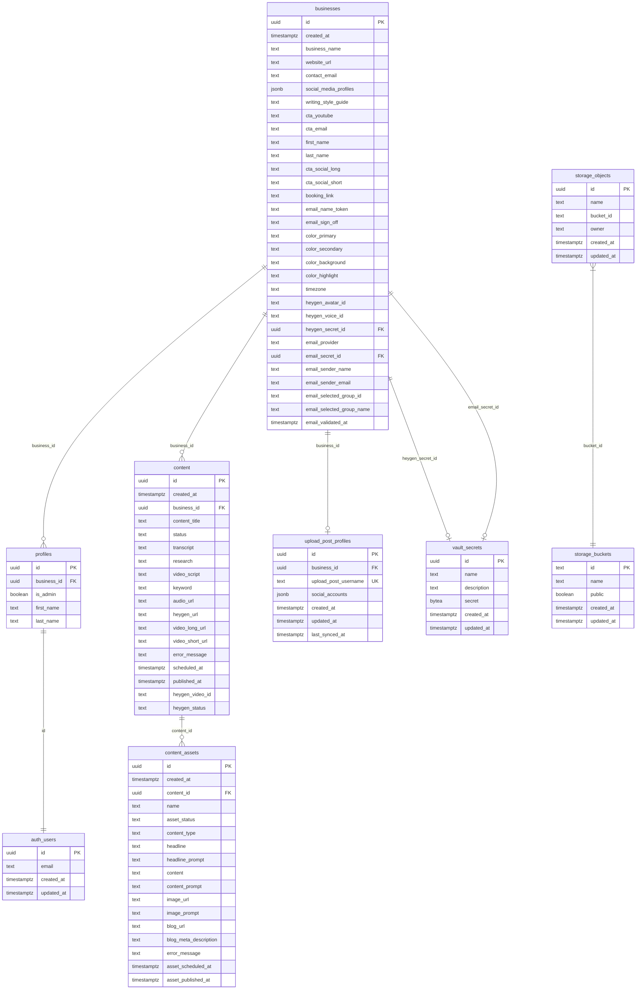

# PRD: Email Integration System

## 📋 Related Documentation
- **[Technical Specification](./email-integration-technical-spec.md)** - Complete implementation details with API calls, code examples, and database schemas
- **[HTML Mockup](./integrations-page-mockup.html)** - Visual design and layout reference for the integrations page
- **This Document** - Product requirements, user stories, and implementation phases

## Overview
This PRD outlines the development of an email integration system that allows users to connect and configure email service providers (MailerLite, MailChimp, Brevo) for sending marketing campaigns through the Transformo platform.

## Objectives
- Enable users to configure email service provider integrations
- Provide API key validation and management
- Allow selection of email groups/lists for targeting
- Configure sender information (name and email)
- Maintain clean integration state management

## User Stories

### Primary User Stories
1. **As a user**, I want to select an email service provider from a dropdown so I can integrate my preferred email platform
2. **As a user**, I want to enter my API key and have it validated automatically so I know the connection is working
3. **As a user**, I want to configure my sender name and email address so recipients know who the email is from
4. **As a user**, I want to select from my available email groups/lists so I can target the right audience
5. **As a user**, I want to see a clear status indicator showing my integration is working correctly

### Secondary User Stories
1. **As a user**, I want to switch between different email providers and have my previous settings cleared so I don't have conflicting configurations
2. **As a user**, I want to deactivate an integration while preserving my settings so I can easily reactivate it later
3. **As a user**, I want clear error messages when my API key is invalid so I can troubleshoot the issue

## Functional Requirements

### 1. Email Provider Selection
- **Dropdown Component**: Users can select from:
  - Off/Disabled (default)
  - MailerLite
  - MailChimp
  - Brevo
- **State Management**: Only one provider can be active at a time
- **Provider Switching**: Selecting a new provider clears all previous provider settings

### 2. API Key Management
- **Conditional UI**: Following HeyGen pattern for consistency:
  - **When no key set**: Shows password input field for API key entry
  - **When key is set**: Shows disabled input with dots (`••••••••••••••••`) and red "Remove" button
- **Write-only Security**: Once saved, API key is never displayed, only shows placeholder dots
- **Automatic Validation**: API key is validated by fetching groups/lists when entered
- **Status Indicator**: Visual feedback showing validation status:
  - ✅ "API Key Valid" (green)  
  - ❌ "Invalid API Key" (red)
  - ⏳ "Validating..." (yellow)
- **Remove Functionality**: Red destructive button to clear the API key and return to input mode

### 3. Sender Configuration
- **Sender Name**: Text input for the sender's display name
- **Sender Email**: Email input with validation for proper email format
- **Persistence**: Settings saved to database upon successful validation

### 4. Group/List Selection
- **Dynamic Loading**: Groups fetched from the selected provider using the validated API key
- **Dropdown Selection**: Users can select which group/list to send campaigns to
- **Refresh Capability**: Option to refresh the groups list

### 5. Integration Status
- **Visual Status Card**: Shows current integration state
- **Connection Status**: Connected/Disconnected indicator
- **Last Sync Time**: Timestamp of last successful API validation
- **Quick Actions**: Test connection, refresh groups

## Technical Requirements

### Database Schema (Following HeyGen Vault Pattern)

#### Complete Database Entity Relationship Diagram



> **🔐 Security Note**: The `vault_secrets` table uses Supabase Vault encryption. The `secret` column contains the encrypted email provider API keys, which are automatically encrypted/decrypted by Postgres using the `pgsodium` extension.

**Extending businesses table** (exactly like HeyGen implementation):
```sql
-- Add email integration columns to businesses table
ALTER TABLE public.businesses
ADD COLUMN IF NOT EXISTS email_provider TEXT CHECK (email_provider IN ('mailerlite', 'mailchimp', 'brevo')),
ADD COLUMN IF NOT EXISTS email_secret_id UUID REFERENCES vault.secrets(id),
ADD COLUMN IF NOT EXISTS email_sender_name TEXT,
ADD COLUMN IF NOT EXISTS email_sender_email TEXT,
ADD COLUMN IF NOT EXISTS email_selected_group_id TEXT,
ADD COLUMN IF NOT EXISTS email_selected_group_name TEXT,
ADD COLUMN IF NOT EXISTS email_validated_at TIMESTAMP WITH TIME ZONE;
```

**Vault RPC Functions** (copied from HeyGen pattern):
```sql
-- Function to set/update the Email API key
CREATE OR REPLACE FUNCTION public.set_email_key(p_business_id uuid, p_new_key text)
RETURNS void
LANGUAGE plpgsql SECURITY DEFINER SET search_path = public, vault
AS $$
DECLARE
  v_secret_id UUID;
  v_secret_name TEXT;
BEGIN
  SELECT email_secret_id INTO v_secret_id FROM public.businesses WHERE id = p_business_id;
  IF v_secret_id IS NULL THEN
    v_secret_name := 'email_api_key_for_business_' || p_business_id::text;
    v_secret_id := vault.create_secret(p_new_key, v_secret_name, 'Email provider API key for business');
    UPDATE public.businesses SET email_secret_id = v_secret_id WHERE id = p_business_id;
  ELSE
    PERFORM vault.update_secret(v_secret_id, p_new_key);
  END IF;
END;
$$;
GRANT EXECUTE ON FUNCTION public.set_email_key(uuid, text) TO authenticated;

-- Function to delete the Email API key
CREATE OR REPLACE FUNCTION public.delete_email_key(p_business_id uuid)
RETURNS void
LANGUAGE plpgsql SECURITY DEFINER SET search_path = public, vault
AS $$
DECLARE
  v_secret_id UUID;
BEGIN
  SELECT email_secret_id INTO v_secret_id FROM public.businesses WHERE id = p_business_id;
  IF v_secret_id IS NOT NULL THEN
    -- FIRST: Clear the reference to avoid FK constraint violation
    UPDATE public.businesses SET email_secret_id = NULL WHERE id = p_business_id;
    -- THEN: Delete the secret from vault.secrets
    DELETE FROM vault.secrets WHERE id = v_secret_id;
  END IF;
END;
$$;
GRANT EXECUTE ON FUNCTION public.delete_email_key(uuid) TO authenticated;

-- Function to retrieve the Email API key (for email sending workflows)
CREATE OR REPLACE FUNCTION public.get_email_secret(p_business_id uuid)
RETURNS TEXT
LANGUAGE plpgsql SECURITY DEFINER SET search_path = public, vault
AS $$
DECLARE
  v_secret_id UUID;
  v_secret_value TEXT;
BEGIN
  SELECT email_secret_id INTO v_secret_id FROM public.businesses WHERE id = p_business_id;
  IF v_secret_id IS NOT NULL THEN
    SELECT decrypted_secret INTO v_secret_value FROM vault.decrypted_secrets WHERE id = v_secret_id;
    RETURN v_secret_value;
  END IF;
  RETURN NULL;
END;
$$;
GRANT EXECUTE ON FUNCTION public.get_email_secret(uuid) TO authenticated;
```

### Server Actions (Following HeyGen Pattern)

Using Next.js Server Actions with Supabase RPC functions (exactly like HeyGen):

#### 1. Email Settings Server Actions
```typescript
// Update email integration settings
export async function updateEmailSettings(
  businessId: string,
  formData: {
    email_provider?: string;
    email_api_key?: string;
    email_sender_name?: string;
    email_sender_email?: string;
    email_selected_group_id?: string;
    email_selected_group_name?: string;
  }
) {
  const supabase = await createClient();

  // Only update the secret if a new key was provided
  if (formData.email_api_key) {
    const { error: rpcError } = await supabase.rpc('set_email_key', {
      p_business_id: businessId,
      p_new_key: formData.email_api_key,
    });
    if (rpcError) return { error: `Database error: ${rpcError.message}` };
  }

  // Update non-sensitive fields in businesses table
  const { error: updateError } = await supabase
    .from('businesses')
    .update({
      email_provider: formData.email_provider,
      email_sender_name: formData.email_sender_name,
      email_sender_email: formData.email_sender_email,
      email_selected_group_id: formData.email_selected_group_id,
      email_selected_group_name: formData.email_selected_group_name,
      email_validated_at: new Date().toISOString(),
    })
    .eq('id', businessId);

  if (updateError) return { error: `Could not update settings: ${updateError.message}` };
  return { success: true };
}

// Remove email API key
export async function removeEmailApiKey(businessId: string) {
  const supabase = await createClient();
  
  const { error } = await supabase.rpc('delete_email_key', {
    p_business_id: businessId,
  });

  if (error) return { error: `Database error: ${error.message}` };
  return { success: true };
}
```

#### 2. API Routes for Group Fetching
- **GET** `/api/email-integration/groups`
  - Fetches available groups for the configured provider
  - Uses `get_email_secret()` RPC to retrieve API key
  - Returns: `{ success, groups, error? }`

### Provider-Specific API Integration

#### MailerLite API
- **Base URL**: `https://connect.mailerlite.com/api/`
- **Authentication**: Bearer token in Authorization header
- **Groups Endpoint**: `GET /groups`
- **Validation**: Successful groups fetch validates API key

#### MailChimp API
- **Base URL**: `https://{dc}.api.mailchimp.com/3.0/`
- **Authentication**: API key in Authorization header
- **Lists Endpoint**: `GET /lists`
- **Validation**: Successful lists fetch validates API key

#### Brevo API
- **Base URL**: `https://api.brevo.com/v3/`
- **Authentication**: API key in api-key header
- **Lists Endpoint**: `GET /contacts/lists`
- **Validation**: Successful lists fetch validates API key

## User Interface Requirements

### Integration Settings Page
Location: `/settings/integrations` (new tab or section)

#### Components Needed:
1. **EmailIntegrationForm**: Main form component (similar to `HeygenSettingsForm`)
2. **State Management**: 
   - `const [isKeySet, setIsKeySet] = useState(!!business.email_secret_id);`
   - Form with react-hook-form and Zod validation
3. **API Key Field**: Exact HeyGen pattern implementation:
   ```jsx
   {isKeySet ? (
     <div className="flex items-center space-x-2">
       <Input type="password" placeholder="••••••••••••••••" disabled />
       <Button type="button" variant="destructive" onClick={handleRemoveKey}>
         Remove
       </Button>
     </div>
   ) : (
     <FormControl>
       <Input type="password" placeholder="Enter your email provider API key" {...field} />
     </FormControl>
   )}
   ```
4. **Server Action Integration**: 
   - `updateEmailSettings()` and `removeEmailApiKey()` actions
   - Toast notifications matching HeyGen pattern

#### User Flow:
1. User navigates to integrations settings
2. Selects email provider from dropdown
3. Enters API key in password field (triggers automatic validation)
4. If valid, configures sender information
5. Selects target group from fetched list
6. Saves configuration - API key input converts to dots with Remove button
7. Sees success confirmation and status
8. **Optional**: User can click Remove button to clear API key and return to input mode

## Error Handling

### API Key Validation Errors
- **Invalid API Key**: "Invalid API key. Please check your credentials and try again."
- **Network Error**: "Unable to connect to {provider}. Please check your internet connection."
- **Rate Limit**: "Too many requests. Please wait a moment and try again."
- **Server Error**: "Service temporarily unavailable. Please try again later."

### Configuration Errors
- **Missing Fields**: "Please fill in all required fields."
- **Invalid Email**: "Please enter a valid sender email address."
- **No Groups**: "No email groups found. Please create a group in your {provider} account first."

## Non-Functional Requirements

### Security
- API keys encrypted at rest in database
- HTTPS required for all API communications
- Input validation and sanitization
- Rate limiting on API endpoints
- Write-only API key pattern (following HeyGen implementation)

#### API Key Input Component Pattern (Consistent with HeyGen):
```jsx
{isApiKeySet ? (
  <div className="flex items-center space-x-2">
    <Input type="password" placeholder="••••••••••••••••" disabled />
    <Button type="button" variant="destructive" onClick={handleRemoveKey}>
      Remove
    </Button>
  </div>
) : (
  <FormControl>
    <Input type="password" placeholder="Enter your email provider API key" {...field} />
  </FormControl>
)}
```

### Performance
- API key validation response within 5 seconds
- Groups fetching within 10 seconds
- Real-time status updates in UI

### Scalability
- Support for additional providers through plugin architecture
- Configurable timeout settings
- Async processing for long-running operations

## Future Considerations

### Additional Providers
- Campaign Monitor
- Constant Contact
- SendGrid
- ConvertKit


### Integration Points
- **n8n Workflow**: Email campaigns can be triggered from automation workflows
- **HeyGen**: Personalized video content can be embedded in email campaigns
- **Content Generation**: AI-generated email content integration

## Success Metrics
- Integration setup completion rate > 90%
- API key validation success rate > 95%
- User retention after email integration setup
- Campaign send success rate through integrations

### TypeScript Types Update
Following HeyGen pattern, manually update `types/supabase.ts`:

```typescript
// Add to businesses table definition
export interface Database {
  public: {
    Tables: {
      businesses: {
        Row: {
          // ... existing fields ...
          email_provider: string | null;
          email_secret_id: string | null;
          email_sender_name: string | null;
          email_sender_email: string | null;
          email_selected_group_id: string | null;
          email_selected_group_name: string | null;
          email_validated_at: string | null;
        }
        // ... rest of table definition
      }
      // ... other tables
    }
  }
}
```

## Dependencies
- Supabase Vault for secure API key storage (exactly like HeyGen)
- Next.js Server Actions for backend logic (exactly like HeyGen)
- ShadCN UI components for frontend
- Provider-specific API documentation and SDKs

## Implementation Phases

### Phase 1: Database Foundation & Vault Setup
**Goal**: Set up secure API key storage using Supabase Vault (following HeyGen pattern)

#### Database Schema & Migrations
- [x] Create migration file: `YYYYMMDDHHMMSS_implement_email_vault_feature.sql`
- [x] Add email integration columns to `businesses` table:
  - [x] `email_provider TEXT CHECK (email_provider IN ('mailerlite', 'mailchimp', 'brevo'))`
  - [x] `email_secret_id UUID REFERENCES vault.secrets(id)`
  - [x] `email_sender_name TEXT`
  - [x] `email_sender_email TEXT`
  - [x] `email_selected_group_id TEXT`
  - [x] `email_selected_group_name TEXT`
  - [x] `email_validated_at TIMESTAMP WITH TIME ZONE`

#### Vault RPC Functions
- [x] Create `set_email_key(p_business_id uuid, p_new_key text)` function
- [x] Create `delete_email_key(p_business_id uuid)` function
- [x] Create `get_email_secret(p_business_id uuid)` function
- [x] Grant proper permissions to `authenticated` role
- [x] Test RPC functions work correctly

#### Apply Migration
- [x] Run `supabase db push` to apply migration
- [x] Verify all columns and functions exist in database
- [x] Test vault integration manually

---

### Phase 2: TypeScript Types & Server Actions
**Goal**: Implement backend logic following HeyGen Server Actions pattern

#### TypeScript Types
- [x] Update `types/supabase.ts` manually with new business table fields
- [x] Add email integration types to business interface
- [x] Verify type safety throughout application

#### Server Actions Implementation
- [x] Create/extend `app/actions/settings.ts` file
- [x] Implement `updateEmailSettings()` server action:
  - [x] Zod schema validation for email settings
  - [x] API key storage via `set_email_key` RPC
  - [x] Non-sensitive data update in businesses table
  - [x] Error handling and response formatting
- [x] Implement `removeEmailApiKey()` server action:
  - [x] Call `delete_email_key` RPC function
  - [x] Proper error handling
  - [x] UI state management
- [x] Add `revalidatePath('/settings/integrations')` for cache invalidation
  - [x] **Important**: Use exact path `/settings/integrations` to match page route
- [x] Test server actions with sample data

---

### Phase 3: Provider API Integration
**Goal**: Implement email provider API clients for validation and group fetching

#### API Client Library
- [x] Create `lib/email-providers.ts` with provider abstractions
- [x] Implement MailerLite API client:
  - [x] Base URL: `https://connect.mailerlite.com/api/`
  - [x] Bearer token authentication
  - [x] Groups endpoint: `GET /groups`
  - [x] Error handling and validation
- [x] Implement MailChimp API client:
  - [x] Dynamic base URL: `https://{dc}.api.mailchimp.com/3.0/`
  - [x] API key authentication
  - [x] Lists endpoint: `GET /lists`
  - [x] Error handling and validation
- [x] Implement Brevo API client:
  - [x] Base URL: `https://api.brevo.com/v3/`
  - [x] API key header authentication
  - [x] Lists endpoint: `GET /contacts/lists`
  - [x] Error handling and validation

#### API Route for Group Fetching
- [x] Create `app/api/email-integration/groups/route.ts`
- [x] Implement business authentication check
- [x] Use `get_email_secret()` RPC to retrieve API key
- [x] Call appropriate provider API based on `email_provider`
- [x] Return standardized group/list format
- [x] Comprehensive error handling for API failures

---

### Phase 4: Frontend Components & UI
**Goal**: Create user interface following exact HeyGen form pattern

#### Prerequisites Check
- [x] **Install Required ShadCN Components**:
  ```bash
  npx shadcn-ui@latest add select
  npx shadcn-ui@latest add input  
  npx shadcn-ui@latest add button
  npx shadcn-ui@latest add form
  npx shadcn-ui@latest add card
  ```
- [x] **Verify Required Dependencies** in `package.json`:
  - `@hookform/resolvers`
  - `react-hook-form`
  - `zod`
  - `sonner` (for toast notifications)
  - `lucide-react` (for icons)
- [x] **Verify Existing Components Available**:
  - Check `components/ui/` directory has all required components
  - Test import paths work correctly

#### Email Integration Form Component
- [x] Create `components/shared/settings/email-integration-form.tsx`
- [x] Implement form structure with react-hook-form and Zod
- [x] Add provider selection dropdown (Off, MailerLite, MailChimp, Brevo)
- [x] Implement API key input with HeyGen pattern:
  - [x] `const [isKeySet, setIsKeySet] = useState(!!business.email_secret_id)`
  - [x] Conditional rendering: input OR dots + Remove button
  - [x] Proper styling with `variant="destructive"` for Remove button
- [x] Add sender name and email inputs with validation
- [x] Implement group selection dropdown with dynamic loading
- [x] Add form submission handling with server actions
- [x] Add toast notifications matching HeyGen pattern

#### Form Integration & State Management
- [x] Handle provider switching (clear previous settings)
- [x] Implement API key validation on entry
- [x] Show validation status indicators (✅❌⏳)
- [x] Group fetching and selection logic
- [x] Form reset and error state handling
- [x] Loading states for all async operations

#### Settings Page Integration
- [x] Add EmailIntegrationForm to settings integrations page
- [x] Create appropriate card layout and styling
- [x] Ensure consistent styling with existing integrations
- [x] Test responsive design and accessibility

---

### Phase 5: Validation & Error Handling
**Goal**: Implement comprehensive validation and user feedback

#### API Key Validation
- [x] Automatic validation when API key is entered
- [x] Test connection by fetching groups/lists
- [x] Clear error messages for different failure types:
  - [x] "Invalid API key. Please check your credentials and try again."
  - [x] "Unable to connect to {provider}. Please check your internet connection."
  - [x] "Too many requests. Please wait a moment and try again."
  - [x] "Service temporarily unavailable. Please try again later."

#### Form Validation
- [x] Required field validation with clear messages
- [x] Email format validation for sender email
- [x] Provider-specific validation rules
- [x] Real-time validation feedback
- [x] Prevent form submission with invalid data

#### Group Management
- [x] Handle "No groups found" scenario
- [x] Refresh groups functionality
- [x] Group selection persistence
- [x] Loading states for group operations

---

### Phase 6: Testing & Polish
**Goal**: Comprehensive testing and production readiness

#### End-to-End Testing
- [x] Test complete flow: Provider selection → API key → Validation → Configuration → Save
- [x] Test API key removal and re-entry
- [x] Test provider switching (settings clearing)
- [x] Test form validation and error scenarios
- [x] Test integration with each email provider (MailerLite, MailChimp, Brevo)

#### Security Verification
- [x] Verify API keys are encrypted in vault.secrets table
- [x] Verify API keys never appear in businesses table
- [x] Test RPC function permissions
- [x] Verify write-only API key pattern works correctly
- [x] Test vault deletion and cleanup

#### Documentation & Deployment
- [x] Update API documentation
- [x] Create user guide for email integration setup
- [x] Test deployment to production environment
- [x] Monitor error rates and performance metrics


---

## Success Criteria
- [x] **Integration Setup**: >90% completion rate for email provider setup
- [x] **API Validation**: >95% success rate for API key validation
- [x] **Security**: All API keys properly encrypted in Supabase Vault
- [x] **UX Consistency**: Identical pattern to HeyGen integration
- [x] **Error Handling**: Clear, actionable error messages for all failure scenarios
- [x] **Performance**: All operations complete within specified timeframes

## Dependencies Checklist
- [x] Supabase Vault enabled and functional
- [x] HeyGen integration working (for pattern reference)
- [x] ShadCN UI components available
- [x] Provider API documentation accessible
- [x] Test accounts for MailerLite, MailChimp, and Brevo

---

## 🔗 Implementation Guide

### Step 1: Review All Documents
1. **This PRD** - Understand business requirements and phased approach
2. **[Technical Specification](./email-integration-technical-spec.md)** - Get complete code examples and API details
3. **[HTML Mockup](./integrations-page-mockup.html)** - Reference final UI design and styling

### Step 2: Follow the Phases
Use the **Implementation Phases** section above as your checklist, referencing the **Technical Specification** for exact code implementations.

### Step 3: Implementation Order
1. **Phase 1**: Database migration (use SQL from Technical Spec)
2. **Phase 2**: Server actions (use code from Technical Spec)  
3. **Phase 3**: Provider APIs (use library from Technical Spec)
4. **Phase 4**: React component (use component from Technical Spec)
5. **Phase 5**: Validation & error handling
6. **Phase 6**: Testing & polish

### Step 4: Reference Points
- **UI/UX**: Follow HTML mockup exactly
- **Code Patterns**: Copy HeyGen implementation exactly
- **Security**: Use Vault pattern from Technical Spec
- **API Integration**: Use provider clients from Technical Spec

**✅ Everything needed for implementation is documented across these three files.** 